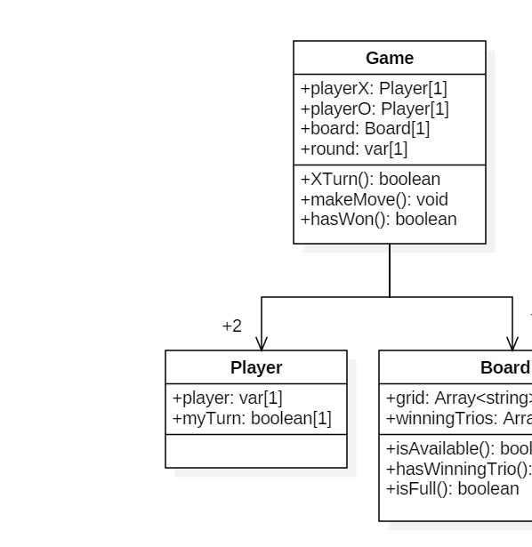
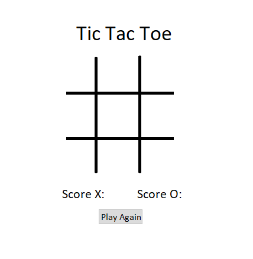

# Design Report

## Introduction
This is a simple implementation of the well known game TicTacToe. 
It is a part of Late-term Assignment in the class SC-T-303-HUGB at the Computer Science Department at Reykjavík University. 
The focus of this project is to learn the best practices of a source control system and use different tools to use test driven development, continuous integration and development.

## The system

This system is a simple game of the well known game TicTacToe. 
The game is a great way to spend time and challenge your friends.
The user group is very large as everyone can have fun playing TicTacToe from a very young age.

## The design 

The game was designed to be very simple and easy to navigate.

In the class diagram in image 1 all classes of the system are demonstrated with their attributes and functions. 
The focus of the design was that the code should be very clear regarding function and variable names. The code should also be be loosely coupled.

 

*Image 1: A class diagram for the code design.*

The design of the User Interface should be as simple as can be.
The traditional game board is in the center of the page and then the players should be able to see their current score very easily.
On the page there is also a button for the players to start a new game.
In image 2 is a simple prototype of the user interface:

 
*Image 2: A prototype for the user interface.*

